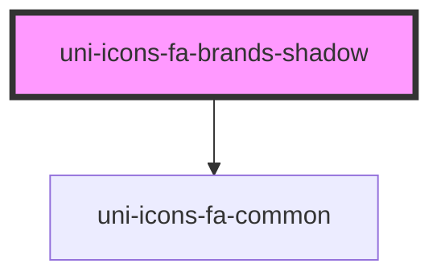

# uni-icons-fa-brands-shadow

<!-- Auto Generated Below -->

## Properties

| Property            | Attribute | Description | Type                                                        | Default     |
| ------------------- | --------- | ----------- | ----------------------------------------------------------- | ----------- |
| `color`             | `color`   |             | `"accent" \| "default" \| "primary" \| "success" \| "warn"` | `'default'` |
| `name` _(required)_ | `name`    |             | `string`                                                    | `undefined` |

## Dependencies

### Depends on

- [uni-icons-fa-common](../../icons-common/element)

### Graph

----------------------------------------------

*Powered by [UiWebKit](https://uiwebkit.com/)*
