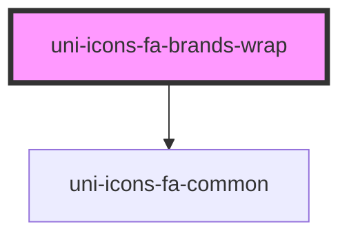

# uni-icons-fa-brands-wrap

<!-- Auto Generated Below -->

## Properties

| Property            | Attribute  | Description | Type      | Default     |
| ------------------- | ---------- | ----------- | --------- | ----------- |
| `active`            | `active`   |             | `boolean` | `false`     |
| `all`               | `all`      |             | `boolean` | `false`     |
| `color`             | `color`    |             | `string`  | `undefined` |
| `name` _(required)_ | `name`     |             | `string`  | `undefined` |
| `selector`          | `selector` |             | `string`  | `undefined` |

## Dependencies

### Depends on

- [uni-icons-fa-common](../../icons-common/element)

### Graph

----------------------------------------------

*Powered by [UiWebKit](https://uiwebkit.com/)*
