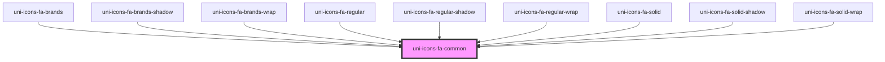

# uni-icons-fa-common

<!-- Auto Generated Below -->

## Dependencies

### Used by

 - [uni-icons-fa-brands](../../icons-brands/element)
 - [uni-icons-fa-brands-shadow](../../icons-brands/shadow)
 - [uni-icons-fa-brands-wrap](../../icons-brands/wrap)
 - [uni-icons-fa-regular](../../icons-regular/element)
 - [uni-icons-fa-regular-shadow](../../icons-regular/shadow)
 - [uni-icons-fa-regular-wrap](../../icons-regular/wrap)
 - [uni-icons-fa-solid](../../icons-solid/element)
 - [uni-icons-fa-solid-shadow](../../icons-solid/shadow)
 - [uni-icons-fa-solid-wrap](../../icons-solid/wrap)

### Graph

----------------------------------------------

*Powered by [UiWebKit](https://uiwebkit.com/)*
