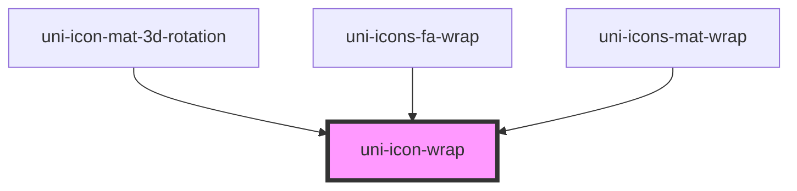

# uni-icon-wrap

<!-- Auto Generated Below -->

## Properties

| Property   | Attribute  | Description | Type                                                        | Default                            |
| ---------- | ---------- | ----------- | ----------------------------------------------------------- | ---------------------------------- |
| `all`      | `all`      |             | `boolean`                                                   | `false`                            |
| `classes`  | `classes`  |             | `string`                                                    | `undefined`                        |
| `color`    | `color`    |             | `"accent" \| "default" \| "primary" \| "success" \| "warn"` | `UniIconDefault.color as UniColor` |
| `degree`   | `degree`   |             | `number`                                                    | `undefined`                        |
| `rotate`   | `rotate`   |             | `boolean`                                                   | `false`                            |
| `selector` | `selector` |             | `string`                                                    | `undefined`                        |
| `size`     | `size`     |             | `"default" \| "lg" \| "md" \| "sm" \| "xs"`                 | `UniIconDefault.size as UniSize`   |
| `speed`    | `speed`    |             | `number`                                                    | `undefined`                        |
| `steps`    | `steps`    |             | `number`                                                    | `undefined`                        |

## Dependencies

### Used by

 - [uni-icon-mat-3d-rotation](../../icon-mat/3d-rotation)
 - [uni-icons-fa-wrap](../../icons-fa/@wrap)
 - [uni-icons-mat-wrap](../../icons-mat/@wrap)

### Graph

----------------------------------------------

*Powered by [UiWebKit](https://uiwebkit.com/)*
