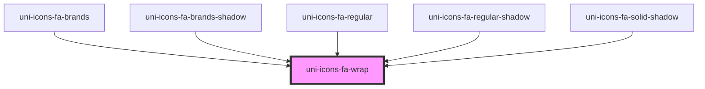

# uni-icons-fa-wrap

<!-- Auto Generated Below -->

## Properties

| Property            | Attribute  | Description | Type                                           | Default     |
| ------------------- | ---------- | ----------- | ---------------------------------------------- | ----------- |
| `all`               | `all`      |             | `boolean`                                      | `false`     |
| `color`             | `color`    |             | `"accent" \| "primary" \| "success" \| "warn"` | `undefined` |
| `degree`            | `degree`   |             | `number`                                       | `undefined` |
| `font`              | `font`     |             | `"brands" \| "regular" \| "solid"`             | `'solid'`   |
| `name` _(required)_ | `name`     |             | `string`                                       | `undefined` |
| `rotate`            | `rotate`   |             | `boolean`                                      | `false`     |
| `selector`          | `selector` |             | `string`                                       | `undefined` |
| `size`              | `size`     |             | `"lg" \| "md" \| "sm" \| "xs" \| number`       | `undefined` |
| `speed`             | `speed`    |             | `number`                                       | `undefined` |
| `steps`             | `steps`    |             | `number`                                       | `undefined` |

## Dependencies

### Used by

 - [uni-icons-fa-brands](../brands/@element)
 - [uni-icons-fa-brands-shadow](../brands/@shadow)
 - [uni-icons-fa-regular](../regular/@element)
 - [uni-icons-fa-regular-shadow](../regular/@shadow)
 - [uni-icons-fa-solid-shadow](../solid/@shadow)

### Graph

----------------------------------------------

*Powered by [UiWebKit](https://uiwebkit.com/)*
