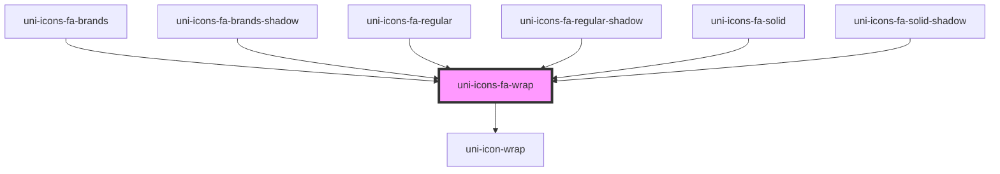

# uni-icons-fa-wrap

<!-- Auto Generated Below -->

## Properties

| Property            | Attribute  | Description | Type                                                        | Default                                    |
| ------------------- | ---------- | ----------- | ----------------------------------------------------------- | ------------------------------------------ |
| `all`               | `all`      |             | `boolean`                                                   | `false`                                    |
| `color`             | `color`    |             | `"accent" \| "default" \| "primary" \| "success" \| "warn"` | `UniIconDefault.color as UniColor`         |
| `degree`            | `degree`   |             | `number`                                                    | `undefined`                                |
| `font`              | `font`     |             | `"brands" \| "regular" \| "solid"`                          | `UniIconsFaDefault.font as UniIconsFaFont` |
| `name` _(required)_ | `name`     |             | `string`                                                    | `undefined`                                |
| `rotate`            | `rotate`   |             | `boolean`                                                   | `false`                                    |
| `selector`          | `selector` |             | `string`                                                    | `undefined`                                |
| `size`              | `size`     |             | `"default" \| "lg" \| "md" \| "sm" \| "xs"`                 | `UniIconDefault.size as UniSize`           |
| `speed`             | `speed`    |             | `number`                                                    | `undefined`                                |
| `steps`             | `steps`    |             | `number`                                                    | `undefined`                                |

## Dependencies

### Used by

 - [uni-icons-fa-brands](../brands/@element)
 - [uni-icons-fa-brands-shadow](../brands/@shadow)
 - [uni-icons-fa-regular](../regular/@element)
 - [uni-icons-fa-regular-shadow](../regular/@shadow)
 - [uni-icons-fa-solid](../solid/@element)
 - [uni-icons-fa-solid-shadow](../solid/@shadow)

### Depends on

- [uni-icon-wrap](../../icon/@wrap)

### Graph

----------------------------------------------

*Powered by [UiWebKit](https://uiwebkit.com/)*
