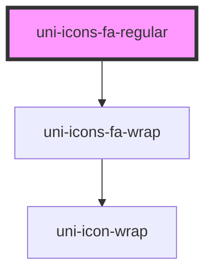

# uni-icons-fa-regular

<!-- Auto Generated Below -->

## Properties

| Property            | Attribute | Description | Type                                                        | Default                            |
| ------------------- | --------- | ----------- | ----------------------------------------------------------- | ---------------------------------- |
| `color`             | `color`   |             | `"accent" \| "default" \| "primary" \| "success" \| "warn"` | `UniIconDefault.color as UniColor` |
| `degree`            | `degree`  |             | `number`                                                    | `undefined`                        |
| `name` _(required)_ | `name`    |             | `string`                                                    | `undefined`                        |
| `rotate`            | `rotate`  |             | `boolean`                                                   | `false`                            |
| `size`              | `size`    |             | `"default" \| "lg" \| "md" \| "sm" \| "xs"`                 | `UniIconDefault.size as UniSize`   |
| `speed`             | `speed`   |             | `number`                                                    | `undefined`                        |
| `steps`             | `steps`   |             | `number`                                                    | `undefined`                        |

## Dependencies

### Depends on

- [uni-icons-fa-wrap](../../@wrap)

### Graph

----------------------------------------------

*Powered by [UiWebKit](https://uiwebkit.com/)*
