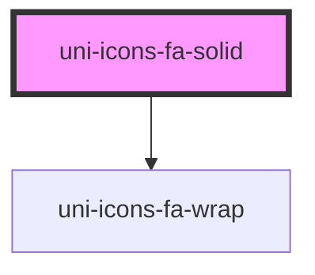

# uni-icons-fa-solid

<!-- Auto Generated Below -->

## Properties

| Property            | Attribute | Description | Type                                           | Default     |
| ------------------- | --------- | ----------- | ---------------------------------------------- | ----------- |
| `color`             | `color`   |             | `"accent" \| "primary" \| "success" \| "warn"` | `undefined` |
| `degree`            | `degree`  |             | `number`                                       | `undefined` |
| `name` _(required)_ | `name`    |             | `string`                                       | `undefined` |
| `rotate`            | `rotate`  |             | `boolean`                                      | `false`     |
| `size`              | `size`    |             | `"lg" \| "md" \| "sm" \| "xs" \| number`       | `undefined` |
| `speed`             | `speed`   |             | `number`                                       | `undefined` |
| `steps`             | `steps`   |             | `number`                                       | `undefined` |

## Dependencies

### Depends on

- [uni-icons-fa-wrap](../../@wrap)

### Graph

----------------------------------------------

*Powered by [UiWebKit](https://uiwebkit.com/)*
