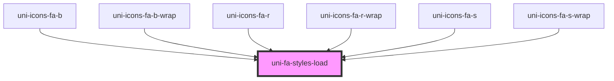

# uni-fa-styles-load

<!-- Auto Generated Below -->

## Dependencies

### Used by

 - [uni-icons-fa-b](../brands/@element)
 - [uni-icons-fa-b-wrap](../brands/@wrap)
 - [uni-icons-fa-r](../regular/@element)
 - [uni-icons-fa-r-wrap](../regular/@wrap)
 - [uni-icons-fa-s](../solid/@element)
 - [uni-icons-fa-s-wrap](../solid/@wrap)

### Graph

----------------------------------------------

*Powered by [UiWebKit](https://uiwebkit.com/)*
