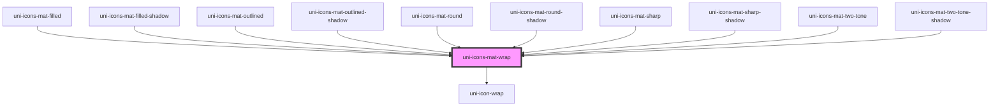

# uni-icons-mat-wrap

<!-- Auto Generated Below -->

## Properties

| Property            | Attribute  | Description | Type                                                         | Default                                      |
| ------------------- | ---------- | ----------- | ------------------------------------------------------------ | -------------------------------------------- |
| `all`               | `all`      |             | `boolean`                                                    | `false`                                      |
| `color`             | `color`    |             | `"accent" \| "default" \| "primary" \| "success" \| "warn"`  | `UniIconDefault.color as UniColor`           |
| `degree`            | `degree`   |             | `number`                                                     | `undefined`                                  |
| `font`              | `font`     |             | `"filled" \| "outlined" \| "round" \| "sharp" \| "two-tone"` | `UniIconsMatDefault.font as UniIconsMatFont` |
| `name` _(required)_ | `name`     |             | `string`                                                     | `undefined`                                  |
| `rotate`            | `rotate`   |             | `boolean`                                                    | `false`                                      |
| `selector`          | `selector` |             | `string`                                                     | `undefined`                                  |
| `size`              | `size`     |             | `"default" \| "lg" \| "md" \| "sm" \| "xs"`                  | `UniIconDefault.size as UniSize`             |
| `speed`             | `speed`    |             | `number`                                                     | `undefined`                                  |
| `steps`             | `steps`    |             | `number`                                                     | `undefined`                                  |

## Dependencies

### Used by

 - [uni-icons-mat-filled](../filled/@element)
 - [uni-icons-mat-filled-shadow](../filled/@shadow)
 - [uni-icons-mat-outlined](../outlined/@element)
 - [uni-icons-mat-outlined-shadow](../outlined/@shadow)
 - [uni-icons-mat-round](../round/@element)
 - [uni-icons-mat-round-shadow](../round/@shadow)
 - [uni-icons-mat-sharp](../sharp/@element)
 - [uni-icons-mat-sharp-shadow](../sharp/@shadow)
 - [uni-icons-mat-two-tone](../two-tone/@element)
 - [uni-icons-mat-two-tone-shadow](../two-tone/@shadow)

### Depends on

- [uni-icon-wrap](../../icon/@wrap)

### Graph

----------------------------------------------

*Powered by [UiWebKit](https://uiwebkit.com/)*
