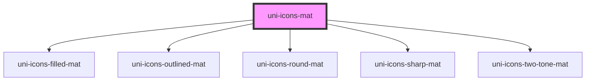

# uni-icons-mat

<!-- Auto Generated Below -->

## Properties

| Property | Attribute | Description | Type                                                         | Default     |
| -------- | --------- | ----------- | ------------------------------------------------------------ | ----------- |
| `color`  | `color`   |             | `string`                                                     | `undefined` |
| `mode`   | `mode`    |             | `"filled" \| "outlined" \| "round" \| "sharp" \| "two-tone"` | `'filled'`  |
| `name`   | `name`    |             | `string`                                                     | `undefined` |

## Dependencies

### Depends on

- [uni-icons-filled-mat](../../icons-filled-mat/element)
- [uni-icons-outlined-mat](../../icons-outlined-mat/element)
- [uni-icons-round-mat](../../icons-round-mat/element)
- [uni-icons-sharp-mat](../../icons-sharp-mat/element)
- [uni-icons-two-tone-mat](../../icons-two-tone-mat/element)

### Graph

----------------------------------------------

*Powered by [UiWebKit](https://uiwebkit.com/)*
