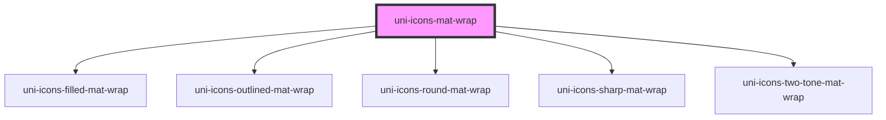

# uni-icons-mat-wrap

<!-- Auto Generated Below -->

## Properties

| Property   | Attribute  | Description | Type                                                         | Default     |
| ---------- | ---------- | ----------- | ------------------------------------------------------------ | ----------- |
| `active`   | `active`   |             | `boolean`                                                    | `false`     |
| `all`      | `all`      |             | `boolean`                                                    | `false`     |
| `color`    | `color`    |             | `string`                                                     | `undefined` |
| `mode`     | `mode`     |             | `"filled" \| "outlined" \| "round" \| "sharp" \| "two-tone"` | `'filled'`  |
| `name`     | `name`     |             | `string`                                                     | `undefined` |
| `selector` | `selector` |             | `string`                                                     | `undefined` |

## Dependencies

### Depends on

- [uni-icons-filled-mat-wrap](../../icons-filled-mat/wrap)
- [uni-icons-outlined-mat-wrap](../../icons-outlined-mat/wrap)
- [uni-icons-round-mat-wrap](../../icons-round-mat/wrap)
- [uni-icons-sharp-mat-wrap](../../icons-sharp-mat/wrap)
- [uni-icons-two-tone-mat-wrap](../../icons-two-tone-mat/wrap)

### Graph

----------------------------------------------

*Powered by [UiWebKit](https://uiwebkit.com/)*
