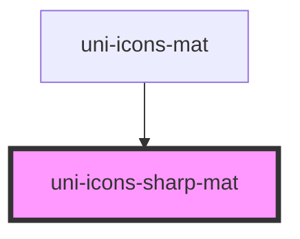

# uni-icons-filled-mat

<!-- Auto Generated Below -->

## Properties

| Property | Attribute | Description | Type     | Default     |
| -------- | --------- | ----------- | -------- | ----------- |
| `color`  | `color`   |             | `string` | `undefined` |
| `name`   | `name`    |             | `string` | `undefined` |

## Dependencies

### Used by

 - [uni-icons-mat](../../icons-mat/element)

### Graph

----------------------------------------------

*Powered by [UiWebKit](https://uiwebkit.com/)*
