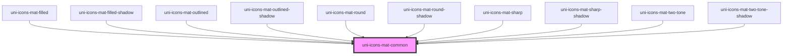

# uni-icons-fa-common

<!-- Auto Generated Below -->

## Dependencies

### Used by

 - [uni-icons-mat-filled](../../icons-filled/element)
 - [uni-icons-mat-filled-shadow](../../icons-filled/shadow)
 - [uni-icons-mat-outlined](../../icons-outlined/element)
 - [uni-icons-mat-outlined-shadow](../../icons-outlined/shadow)
 - [uni-icons-mat-round](../../icons-round/element)
 - [uni-icons-mat-round-shadow](../../icons-round/shadow)
 - [uni-icons-mat-sharp](../../icons-sharp/element)
 - [uni-icons-mat-sharp-shadow](../../icons-sharp/shadow)
 - [uni-icons-mat-two-tone](../../icons-two-tone/element)
 - [uni-icons-mat-two-tone-shadow](../../icons-two-tone/shadow)

### Graph

----------------------------------------------

*Powered by [UiWebKit](https://uiwebkit.com/)*
