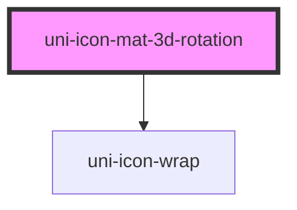

# uni-icon-mat-3d-rotation

<!-- Auto Generated Below -->

## Properties

| Property | Attribute | Description | Type                                                        | Default               |
| -------- | --------- | ----------- | ----------------------------------------------------------- | --------------------- |
| `color`  | `color`   |             | `"accent" \| "default" \| "primary" \| "success" \| "warn"` | `'default'`           |
| `degree` | `degree`  |             | `number`                                                    | `undefined`           |
| `rotate` | `rotate`  |             | `boolean`                                                   | `false`               |
| `size`   | `size`    |             | `string`                                                    | `UniIconDefault.size` |
| `speed`  | `speed`   |             | `number`                                                    | `undefined`           |
| `steps`  | `steps`   |             | `number`                                                    | `undefined`           |

## Dependencies

### Depends on

- [uni-icon-wrap](../../../../icon/wrap)

### Graph

----------------------------------------------

*Powered by [UiWebKit](https://uiwebkit.com/)*
