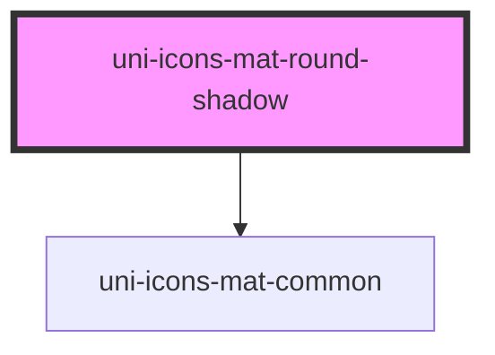

# uni-icons-round-mat-shadow

<!-- Auto Generated Below -->

## Properties

| Property | Attribute | Description | Type                                                        | Default     |
| -------- | --------- | ----------- | ----------------------------------------------------------- | ----------- |
| `color`  | `color`   |             | `"accent" \| "default" \| "primary" \| "success" \| "warn"` | `'default'` |
| `name`   | `name`    |             | `string`                                                    | `undefined` |

## Dependencies

### Depends on

- [uni-icons-mat-common](../../common/element)

### Graph

----------------------------------------------

*Powered by [UiWebKit](https://uiwebkit.com/)*
