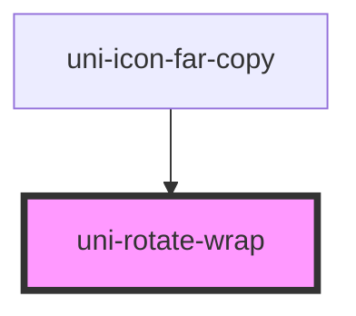

# uni-rotate-wrap

<!-- Auto Generated Below -->

## Properties

| Property   | Attribute  | Description | Type      | Default     |
| ---------- | ---------- | ----------- | --------- | ----------- |
| `all`      | `all`      |             | `boolean` | `false`     |
| `degree`   | `degree`   |             | `number`  | `undefined` |
| `selector` | `selector` |             | `string`  | `undefined` |
| `speed`    | `speed`    |             | `number`  | `undefined` |
| `steps`    | `steps`    |             | `number`  | `undefined` |

## Dependencies

### Used by

 - [uni-icon-far-copy](../../icon-fa/regular/copy)

### Graph

----------------------------------------------

*Powered by [UiWebKit](https://uiwebkit.com/)*
