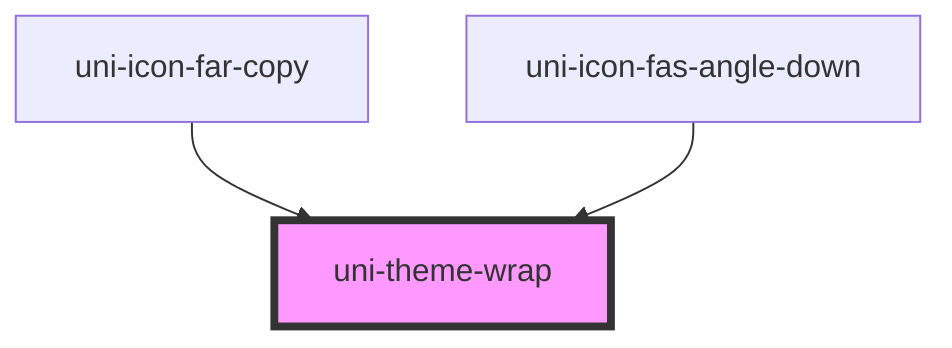

# uni-theme-wrap

<!-- Auto Generated Below -->

## Properties

| Property   | Attribute  | Description | Type                                           | Default     |
| ---------- | ---------- | ----------- | ---------------------------------------------- | ----------- |
| `all`      | `all`      |             | `boolean`                                      | `false`     |
| `classes`  | `classes`  |             | `string`                                       | `undefined` |
| `color`    | `color`    |             | `"accent" \| "primary" \| "success" \| "warn"` | `undefined` |
| `selector` | `selector` |             | `string`                                       | `undefined` |
| `size`     | `size`     |             | `"lg" \| "md" \| "sm" \| "xs" \| number`       | `undefined` |

## Dependencies

### Used by

 - [uni-icon-far-copy](../../icon-fa/regular/copy)
 - [uni-icon-fas-angle-down](../../icon-fa/solid/angle-down)

### Graph

----------------------------------------------

*Powered by [UiWebKit](https://uiwebkit.com/)*
